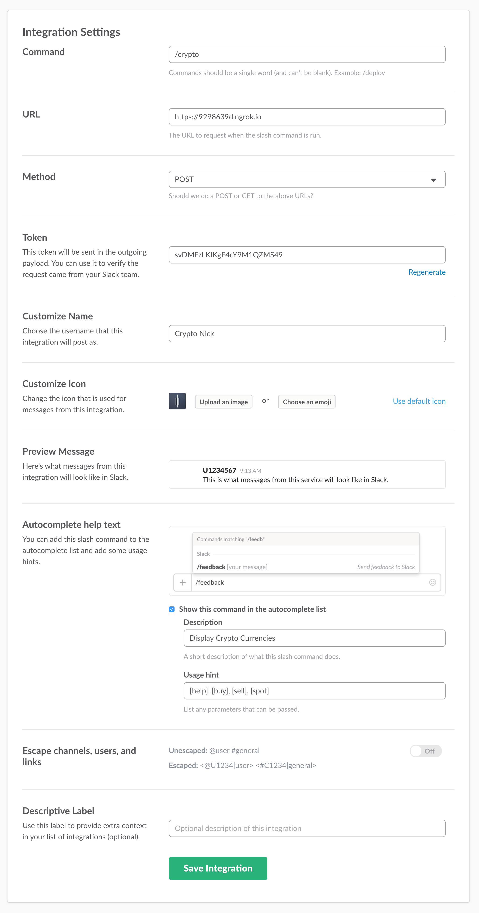

# Crypto Currency for Slack

CryptoNick is a Slack app that uses the [Coinbase API](https://developers.coinbase.com/api/v2) to look up crypto currency information.


### Commands
- `/crypto buy` - Get the total price to buy each currency.
- `/crypto sell` - Get the total price to sell each currency.
- `/crypto spot` - Get the current market price for bitcoin.

### Install CryptoNick on Slack
Authenticate from this button

<a href="https://slack.com/oauth/authorize?scope=commands+team%3Aread&client_id=4912920482.226577161524"></a>

### Getting Started Locally

Install NPM dependencies
```
$ npm install
```

Rename `.env-example` to `.env` and update the variables to use your Coinbase API key and secret credentials.

> Don't have an API Key? Getting started here - https://www.coinbase.com/settings/api

Run Node app
```
$ node index.js
```

**Configuring Your Slash Command**

Start by adding a custom integration for a new slash command. In my case, I entered  /crypto and hit the Add Slash Command Integration button to go to the next page.



You can skip most of the fields for now, but you must enter the (1) Command, (2) URL, and make sure the (3) Method is POST.

For the URL, I am using a temporary URL from `ngrok`, which serves my localhost to a public URL.

**Optional: Using ngrok**

If you wish to use ngrok for your development too, download ngrok from https://ngrok.com, run it on terminal:

```
$ ngrok http 3000
```


Now you’ve got a ngrok URLs for your local server. In this case, copy this URL, https://c17f617d.ngrok.io and paste it into the configuration setup.

Now, run the node code, then test your command on Slack client

```
$ node index.js
```
### Donate/Support
Show your love for cryptocurrency. Donations to the project are always welcomed :)


**BTC Wallet Address:** `1LE3fKWMtmk7mhCg8pz2Z1inEmanh4vAUM`

### Helpful links
- Coinbase API - https://developers.coinbase.com/api/v2
- Slack Slash Commands - https://api.slack.com/slash-commands
- Ngrok - https://ngrok.com/
